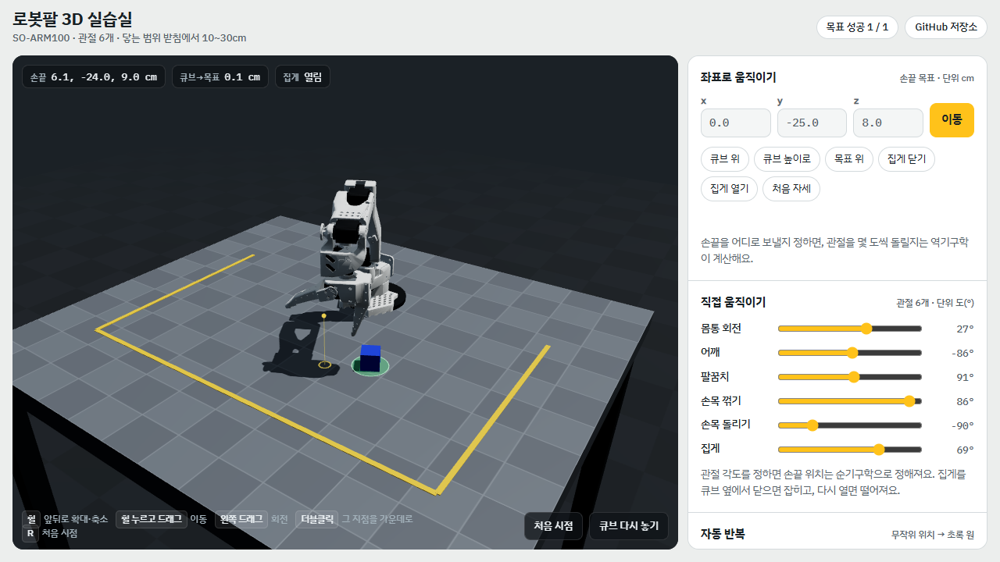
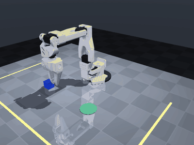

# 로봇팔 3D 실습실 · robot-arm-3d-lab

하드웨어 없이 배우는 피지컬AI. 실제 저가 로봇팔 **SO-ARM100**과 같은 모델을 물리 엔진(MuJoCo)과 브라우저 3D에서 움직여 봅니다. 관절을 직접 돌려 보고(순기구학), 손끝 좌표를 정해 팔이 스스로 자세를 계산하게 하고(역기구학), 큐브를 집어 옮기는 프로그램을 만들어 성공률을 잽니다.

*Learn physical AI without hardware: an SO-ARM100 robot arm simulated with MuJoCo and in the browser (three.js), with a Python API and MCP tools so you can build robot programs together with Claude Code.*

**설치 없이 바로 열기 → https://stanlee7.github.io/robot-arm-3d-lab/**



| 브라우저 버전 (설치 없음) | 데스크톱 버전 (MuJoCo 정밀 물리) |
|---|---|
| 좌표로 움직이기, 관절 6개 막대, 자동 반복·성공률 | 접촉·마찰까지 계산하는 물리 시뮬레이션과 실시간 3D 창 |
| 잡기·떨어짐만 계산하는 간이 물리 | Python API로 로봇 프로그램 작성, Claude Code용 MCP 도구 |



## 마우스 조작 (두 버전 공통)

| 동작 | 결과 |
|---|---|
| 휠을 앞으로 / 뒤로 | 확대 / 축소 |
| 휠 누르고 드래그 | 화면 이동 (데스크톱: Shift를 같이 누르면 바닥을 따라 이동) |
| 왼쪽 드래그 | 회전 |
| 오른쪽 드래그 | 이동 |
| 더블클릭 | 누른 지점을 화면 가운데로 |
| R | 처음 시점 |

## 데스크톱 버전 시작하기

Python 3.10 이상.

```bash
python -m venv .venv
# Windows
.venv\Scripts\pip install -r requirements.txt
.venv\Scripts\python sim\view_demo.py        # 또는 로봇팔_3D데모.bat 더블클릭
# macOS / Linux
.venv/bin/pip install -r requirements.txt
.venv/bin/python sim/view_demo.py
```

창이 뜨면 로봇이 무작위 위치의 파란 큐브를 초록 원으로 계속 옮깁니다. 창을 닫으면 끝납니다.
Windows 11에서 확인했습니다. macOS·Linux는 아직 확인하지 않았습니다.

## 코드로 움직이기 (Python API)

```python
import sys; sys.path.insert(0, "sim")
from robot import Arm

arm = Arm(view=True)                 # view=False면 창 없이 계산만
cube, target = arm.cube(), arm.target()
arm.grip(False)                                       # 집게 열기
arm.move_to((cube[0], cube[1], 0.08))                 # 큐브 위 8cm (단위: m)
arm.move_to((cube[0], cube[1], cube[2] + 0.005))      # 큐브 높이로
arm.grip(True)                                        # 잡기
arm.move_to((target[0], target[1], 0.09))
arm.move_to((target[0], target[1], 0.03))
arm.grip(False)                                       # 놓기
print(arm.state())
```

- 좌표: 작업대 윗면이 z=0, 로봇 받침이 원점, 팔은 -y 쪽을 향합니다. 닿는 범위는 받침에서 수평 약 10~30cm, 높이 2~15cm.
- `move_to`는 손끝(두 집게 날 사이 가운데)을 목표로 보냅니다. 관절 각도는 역기구학이 계산합니다.
- 결과의 `IK오차_m`은 계산상 닿을 수 있는지, `도달오차_m`은 실제로 멈춘 위치와의 차이입니다. 큐브나 작업대에 닿아 멈추면 `도달오차`가 커지고 `비고`에 이유가 적힙니다.
- `python sim/experiment.py 30` — 무작위 위치 30곳에서 집어 옮기기 성공률 측정

## Claude Code와 함께 로봇 프로그램 만들기

이 폴더에서 [Claude Code](https://docs.claude.com/en/docs/claude-code/overview)를 실행하면 `.mcp.json`의 `robot-arm-sim` 도구(상태 보기, 이동, 집게, 카메라, 초기화, 녹화)를 쓸 수 있습니다. Claude에게 프로그램을 만들게 하고, 같은 도구로 바로 돌려 보며 고칩니다. 3D 창에서 움직임이 실시간으로 보입니다.

예시 요청:
- 「sim/robot.py의 Arm으로 큐브를 원 둘레 네 곳에 차례로 옮기는 프로그램을 만들고 성공률을 재 줘」
- 「실험에서 실패한 위치를 찾아 원인을 분석해 줘」

`.mcp.json`은 Windows 경로(`.venv/Scripts/python.exe`)로 되어 있습니다. macOS·Linux에서는 `.venv/bin/python`으로 바꿔 주세요.

## 브라우저 버전 다시 만들기

```bash
python web/export_model.py   # MuJoCo 모델 → web/robot_data.json (부품 모양·관절 축을 그대로)
node web/build.mjs           # → docs/index.html (GitHub Pages)
```

`web/kin.js`의 관절 계산은 MuJoCo와 0.001mm 이하로 같습니다(내보낼 때 넣은 정답 자세 6개로 확인). 역기구학은 목표 92곳 모두 1mm 안으로 풀었습니다.

## 실험 기록

| 실험 | 결과 | 배운 것 |
|---|---|---|
| 무작위 위치 20곳 집어 옮기기 | 14/20 | 실패 6건 모두 받침 가까이(15~19cm)에서 잡은 뒤 팔이 접힌 자세에서 역기구학이 갇힘(오차 13cm) |
| 역기구학을 시작 자세 4개에서 풀어 가장 좋은 답 선택 → 30곳 | 30/30 | 한 자세에서만 풀면 국소해에 빠진다 |
| Claude(Sonnet)가 MCP 도구로 직접 조종 | 목표에서 0.5cm, 도구 13회 | 큐브 쪽으로 내려갈 때 요청 z=2.0cm, 실제 도달 z=3.2cm(집게가 큐브에 닿아 멈춤)인데 도구가 이 차이를 오차로 보고하지 않는다고 Claude가 짚음 → 도구에 도달 오차와 이유를 추가 |
| 브라우저 버전 집어 옮기기 | 첫 점검 목표 중심에서 2.9cm → 수정 후 0.1cm 이하 | 집게는 한쪽 날만 움직이므로, 닫힐 때 큐브를 두 날 가운데로 밀어 넣어야 실제와 같아진다 |

## 파일

```
sim/robot.py        로봇 API (이동·집게·상태·역기구학·녹화)
sim/viewer.py       실시간 3D 창 (마우스 조작)
sim/view_demo.py    자동 반복 데모
sim/experiment.py   성공률 실험
sim/mcp_server.py   Claude Code용 MCP 도구
sim/scene.xml       작업대 장면 (작업대·안전선·목표·큐브)
sim/so_arm100.xml, sim/assets/   SO-ARM100 모델 (MuJoCo Menagerie)
web/                브라우저 버전 소스 (app.html, kin.js, export_model.py, build.mjs)
docs/               GitHub Pages로 배포되는 브라우저 버전
```

## 라이선스

- 이 저장소의 코드: [Apache License 2.0](LICENSE)
- SO-ARM100 모델(`sim/so_arm100.xml`, `sim/assets/`)은 [MuJoCo Menagerie](https://github.com/google-deepmind/mujoco_menagerie/tree/main/trs_so_arm100)의 `trs_so_arm100`을 수정 없이 포함했습니다. 원 로봇은 [The Robot Studio](https://github.com/TheRobotStudio/SO-ARM100)의 SO-ARM100이며 Apache-2.0입니다. 자세한 내용은 [NOTICE](NOTICE).

만든 사람: [stanlee7](https://github.com/stanlee7)
