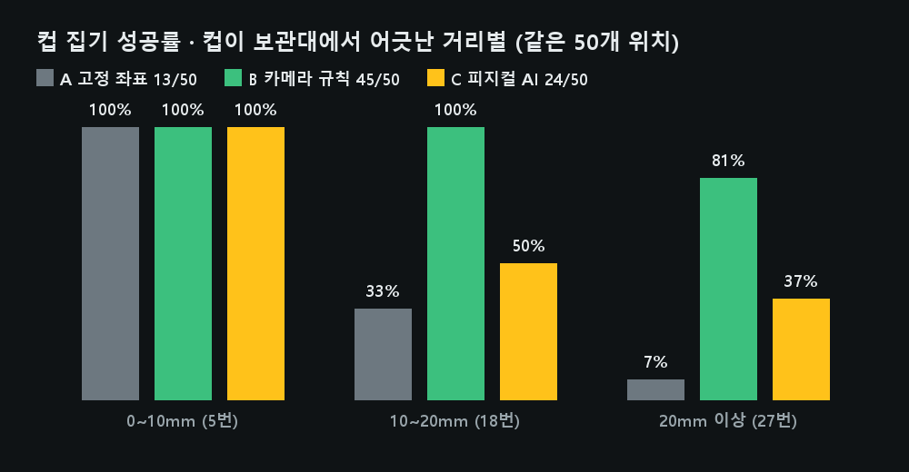
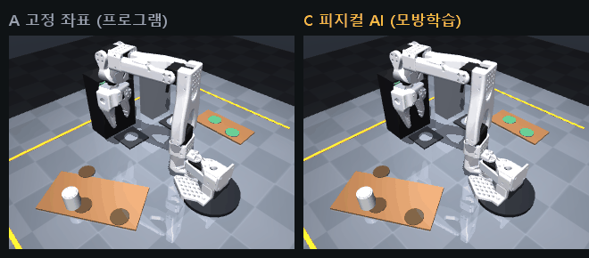

# 프로그램 로봇 vs 피지컬 AI 로봇 — 컵 집기 비교

같은 장면(로봇 바리스타 카페), 같은 과제(보관대의 컵 하나 집어 들기)를 세 방식으로 풀고 성공률을 비교합니다.
컵은 매번 보관대 자리에서 최대 ±25mm 어긋나 있습니다(사람이 대충 채워 넣은 상황).

| 방식 | 로봇이 움직이는 법 | 사람이 한 일 |
|---|---|---|
| **A 고정 좌표** | 정해 둔 보관대 좌표로만 간다. 카메라 없음 | 좌표 입력 |
| **B 카메라 규칙** | 위 카메라 사진에서 「흰 테두리 원」을 찾는 규칙으로 컵 위치를 구해 간다 (로봇 바리스타 방식) | 인식 규칙 작성·조정 |
| **C 피지컬 AI** | 시연을 보고 배운 신경망이 **카메라 사진 + 관절 각도만 보고** 0.1초마다 관절 명령을 낸다. 좌표·역기구학·순서 규칙을 쓰지 않음 | 시연 데이터 모으기·학습 |

## 결과 (같은 50개 위치, 학습 때와 다른 위치)



| | 전체 | 0~10mm | 10~20mm | 20mm 이상 |
|---|---|---|---|---|
| A 고정 좌표 | 13/50 | 5/5 | 6/18 | 2/27 |
| B 카메라 규칙 | **45/50** | 5/5 | 18/18 | 22/27 |
| C 피지컬 AI | 24/50 | 5/5 | 9/18 | 10/27 |

같은 위치(18mm 어긋남)에서 A는 못 집고 C는 집는 장면:



### 읽는 법
- **A**는 환경이 고정돼 있을 때만 됩니다. 실제 공장이 지그(고정 틀)로 물건 자리를 맞추는 이유입니다
- **B**가 가장 잘합니다. 대신 사람이 「컵은 흰 원이다」라는 규칙을 짜고 다듬었습니다. 컵 색·조명이 바뀌면 규칙을 다시 짜야 합니다
- **C**는 규칙 없이 시연 561개만 보고 A의 두 배를 해냅니다. 아직 B보다 낮습니다. 지금 피지컬 AI의 숙제가 **데이터와 학습 방법**이라는 뜻입니다
- 같은 데이터로 신경망 구조만 바꿨더니(`--arch flat`) 학습 데이터를 외워 버려 **6/50**으로 떨어졌습니다. 학습 오차는 더 낮았습니다. 「학습이 잘된 것 같다」와 「현장에서 잘한다」는 다릅니다

## 직접 해 보기

```bash
pip install -r requirements.txt torch        # torch는 C(피지컬 AI)에만 필요. GPU 없어도 됨(느림)

# 1) 바로 비교 — 저장소에 들어 있는 학습된 모델(data/run/policy.pt, 2.3MB)로
python programs/compare/cup_pick.py eval --trials 50

# 2) 처음부터 — 시연 모으기 → 학습 → 평가
python programs/compare/cup_pick.py collect --episodes 600      # 약 3~4분
cd il
python train.py --data ../programs/compare/data/demos.npz --run ../programs/compare/data/run --epochs 80   # RTX 4060 약 4분
cd ..
python programs/compare/cup_pick.py eval --trials 50 --only C
```

`eval`이 끝나면 `programs/compare/data/result.json`에 위치별 결과가 남습니다.

## 도전 과제: AI 코딩 도구로 성공률 올리기

이 저장소를 각자 PC에 받고, **Claude Code · Codex(GPT) · Antigravity(Gemini)** 중 하나에게 맡겨 성공률을 올려 보세요.
채점은 모두 같은 명령으로 합니다: `python programs/compare/cup_pick.py eval --trials 50`

| 과제 | 바꿀 곳 | 생각해 볼 것 |
|---|---|---|
| 1. 규칙 로봇(B)을 50/50으로 | `programs/perception.py`, `cup_pick.py`의 `run_rule` | 어긋남이 큰 5번은 왜 실패했나? 다시 잡기를 넣으면? |
| 2. 피지컬 AI(C)를 B만큼 | `cup_pick.py collect`(시연), `il/policy.py`(신경망), `il/train.py`(학습) | 시연 수, 사진 크기, 흔들기 노이즈, 학습 반복 — **한 번에 하나만** 바꿔 비교 |
| 3. 조건이 바뀌면? | `sim/scene_barista.xml`의 컵 색(`cupwhite`) | 컵을 진한 색으로 바꾸면 B와 C 중 누가 먼저 무너지나? 다시 살리려면 각각 무엇이 필요한가? |

규칙:
- 평가 위치(`eval`의 seed 1234)와 성공 기준(`lifted`)은 바꾸지 않습니다
- 결과는 「무엇을 바꿨나 · 성공률 · 걸린 시간 · AI 도구가 헛짚은 곳」을 함께 적습니다
- 같은 설정도 돌릴 때마다 ±3 정도 흔들립니다. 비교는 시드 여러 개 평균으로 합니다

## 파일

| 파일 | 역할 |
|---|---|
| `cup_pick.py` | 장면 준비, 세 방식, 시연 모으기(`collect`), 평가(`eval`) |
| `make_media.py` | README의 결과 그림·비교 영상 만들기(Windows 맑은 고딕 글꼴 사용) |
| `data/run/` | 학습된 모델과 설정 |
| `../../il/policy.py`, `../../il/train.py` | 신경망(사진 + 관절 → 1초 앞 동작 묶음, ACT의 동작 묶음 아이디어를 작은 CNN으로)과 학습 |
